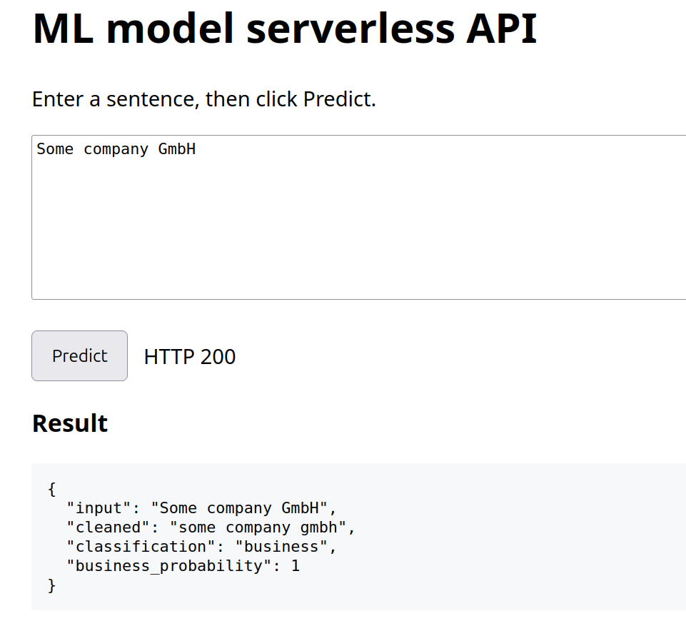
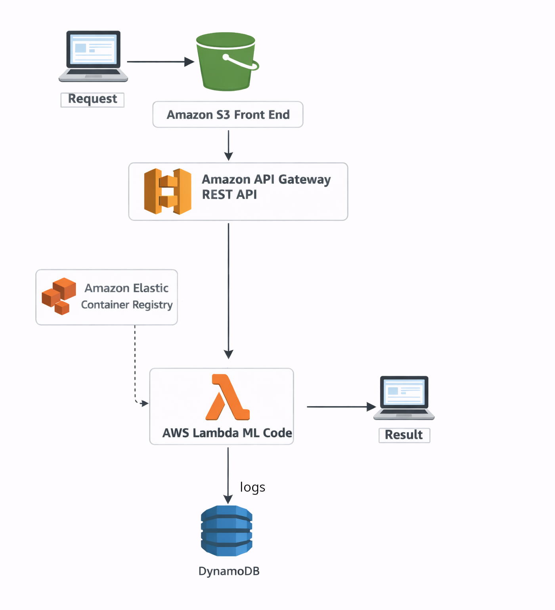

## Deploying machine learning models as serverless API

This is a demo of deploying machine learning models as serverless API.

Sentiment analysis [inference_sentiment_analysis](inference_sentiment_analysis) is a modified code and ML model from AWS blog Anders Christiansen post:   
https://aws.amazon.com/blogs/machine-learning/deploying-machine-learning-models-as-serverless-apis/

Business vs Individual Classifier [inference_business_vs_individual](inference_business_vs_individual) is a modified code and ML model from 
Matthew Jones jonesmwh repository:
https://github.com/jonesmwh/business-individual-classifier

### Application architecture

